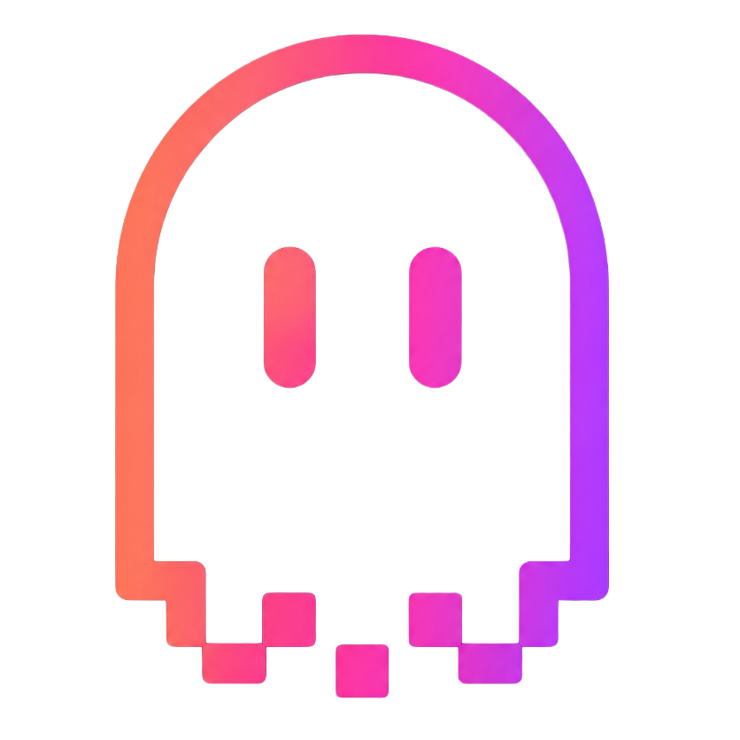

# Ghost Arcade

[](LICENSE)
[](package.json)
[](https://svelte.dev)

**Ghost Arcade** is an open-source projection-mapping & VJ tool. Real-time GLSL effects, WebGPU acceleration, MIDI control, mobile companion, and a Resolume-class mixer pipeline — all in one app.

It's a single product, free, and fully open source under AGPL-3.0. There are no Pro tiers, no paywalls, no watermarks.



---

## Features

- **Mapping Mode** — corner pin + mesh warp on every layer, snap-to-grid, edge feather, multi-output.
- **VJ Mode** — 16-channel clip launcher, dual-deck crossfader, macros, snapshots, audio-reactive parameters, BPM-synced quantize.
- **Effect Engine** — 200+ effects across Color, Stylize, Blur, Light, Distort, Glitch, Feedback, Trails, Atmosphere, Text & Pattern, Advanced 3D, and a Geometric 3D pack with true SDF raymarching.
- **Content Layers** — videos, images, ISF shaders (drag-drop your own), point clouds (.ply/.splat), GLTF/FBX 3D models, lines, light painting, group layers, screen capture, Spout in/out (Windows).
- **WebGPU Output** — zero-copy GPU presenter via WebGPU `importExternalTexture` for true 4K60 with no encode/decode round-trip. Falls back to WebGL transparently.
- **Mobile Companion** — pair any phone over LAN via QR code; control mapping warps, layer opacity/blend, VJ clips, macros, snapshots, output freeze. Uses the same shader catalog the desktop sees.
- **MIDI** — full MIDI Learn, clock sync, controller mapping, dual-bank routing.
- **AI Shader Generation** — bring your own Claude / Gemini / Replicate / Luma keys; edit / iterate generated GLSL inline.
- **Multi-Output** — output windows with crop / rotate / flip per display, Spout sender for hardware projectors / NDI bridges, MP4 recording.

---

## Getting Started

### Prerequisites
- **Node.js** ≥ 20
- **npm** ≥ 10
- **Windows / macOS** (Linux works for browser-only mode)

### Install
```bash
git clone https://github.com/riskcapital/ghost-arcade.git ghost-arcade
cd ghost-arcade
npm install
```

> **Heads up:** `npm install` prints a handful of deprecation warnings (`glob@7`, `rimraf@2`, `boolean@3`, `core-js@2`). These are transitive dependencies of `electron-builder` and `butterchurn-presets` — packages we don't directly control — and they only affect install-time logging. The app builds and runs normally; you can ignore them.

### Run (Desktop — recommended)
```bash
npm run desktop
```
This boots Vite + Electron + the in-process LAN WebSocket server (port 9001) so the mobile companion can connect.

### Run (Browser only — no Spout, no native file dialogs)
```bash
npm start
```
Then open `http://localhost:1420`.

### Mobile Companion
1. Run the desktop app.
2. Click the QR-code button in the toolbar.
3. Scan with any phone on the same Wi-Fi.
4. The mobile UI loads from the desktop's built-in HTTP server (no app install needed).

### Build a Distributable
```bash
npm run build:desktop          # Windows installer
npm run build:desktop:mac      # macOS .dmg
```

---

## Architecture

```
┌──────────────────────────────────────────────────────────────────┐
│  Editor (Svelte 5 + Vite)                                         │
│  ├── Layer pipeline → effect chain → mesh warp → composite        │
│  ├── WebGL2 / WebGPU renderer (renderer/engine.ts)                │
│  └── ISF shader runtime, AnimationMixer, splat renderer           │
└──────────────────┬───────────────────────────────────────────────┘
                   │ canvas.captureStream(60) + WebGPU bridge
┌──────────────────┴───────────────────────────────────────────────┐
│  Output Window (Electron BrowserWindow)                           │
│  ├── Zero-copy WebGPU presenter (default)                         │
│  ├── WebRTC fallback                                              │
│  └── Spout sender (Windows native addon)                          │
└──────────────────────────────────────────────────────────────────┘
                   │ same-LAN WebSocket (port 9001)
┌──────────────────┴───────────────────────────────────────────────┐
│  Mobile Companion (same Svelte app, mobile route)                 │
│  └── Mapping warps, VJ clip launcher, freeze/play, macros         │
└──────────────────────────────────────────────────────────────────┘
```

Key directories:
- `src/lib/components/` — UI panels (LayerPanel, MediaTray, EffectPickerModal, VJModePanel, MobileApp…).
- `src/lib/renderer/` — WebGL2 / WebGPU engine, effect shaders, post-process passes.
- `src/lib/effects/` — effect catalog, parameter metadata, presets.
- `src/lib/stores/` — Svelte stores for layers, settings, vjClipLauncher, mediaLibrary, etc.
- `src/lib/isf/` — ISF parser + thumbnail generator.
- `electron/` — Electron main process, native dialogs, Spout bridge.
- `server/ws-server.js` — LAN WebSocket + HTTP server for mobile companion.
- `public/ISF/` — built-in shader manifest + .fs files.

---

## Contributing

Pull requests welcome. Please:

1. Sign your commits with `git commit -s` (DCO).
2. Run `npm run check` (svelte-check) before submitting.
3. Add a brief note to `CHANGELOG.md` describing user-visible changes.
4. For new effects: include a default preset in `src/lib/effects/effectUX.ts`, a catalog entry in `effectCatalog.ts`, and ParamMeta with sensible min/max/step defaults.

By contributing, you agree your contributions are licensed under AGPL-3.0.

---

## License

**Ghost Arcade** is licensed under the **GNU Affero General Public License v3.0** (AGPL-3.0-only). See [LICENSE](LICENSE) for the full text.

In short:
- ✔ Use it for anything — commercial gigs, installations, broadcasts, your bedroom.
- ✔ Modify the source.
- ✔ Distribute modified versions.
- ⚠ If you run a modified version as a network service, you must offer the source code to your users.
- ⚠ Derivative works must also be AGPL-3.0.

Output you create with Ghost Arcade (videos, livestreams, recordings) is **yours** and is not subject to AGPL.

---

## Acknowledgements

Built on the shoulders of giants:
- [Svelte 5](https://svelte.dev) — reactive UI.
- [Three.js](https://threejs.org) — WebGL/WebGPU rendering.
- [Electron](https://electronjs.org) — desktop runtime.
- [ISF](https://isf.video) — interactive shader format.
- [Šuvakov & Dmitrašinović (2013)](https://arxiv.org/abs/1303.0181) — three-body periodic orbit catalog used in the Geometric 3D pack.

Logo design + visual identity: Risk Capital Media LLC.

---

## Links

- **Website:** [ghostarcade.live](https://ghostarcade.live)
- **Website source:** [`riskcapital/ghostarcade-web`](https://github.com/riskcapital/ghostarcade-web) — separate Next.js repo. Download links live in `src/lib/release.ts` (`RELEASE_VERSION`); see its `UPDATING.md`. Details in [CANONICAL.md](CANONICAL.md#website).
- **Discussions:** [GitHub Discussions](https://github.com/riskcapital/ghost-arcade/discussions)
- **Issues:** [GitHub Issues](https://github.com/riskcapital/ghost-arcade/issues)
